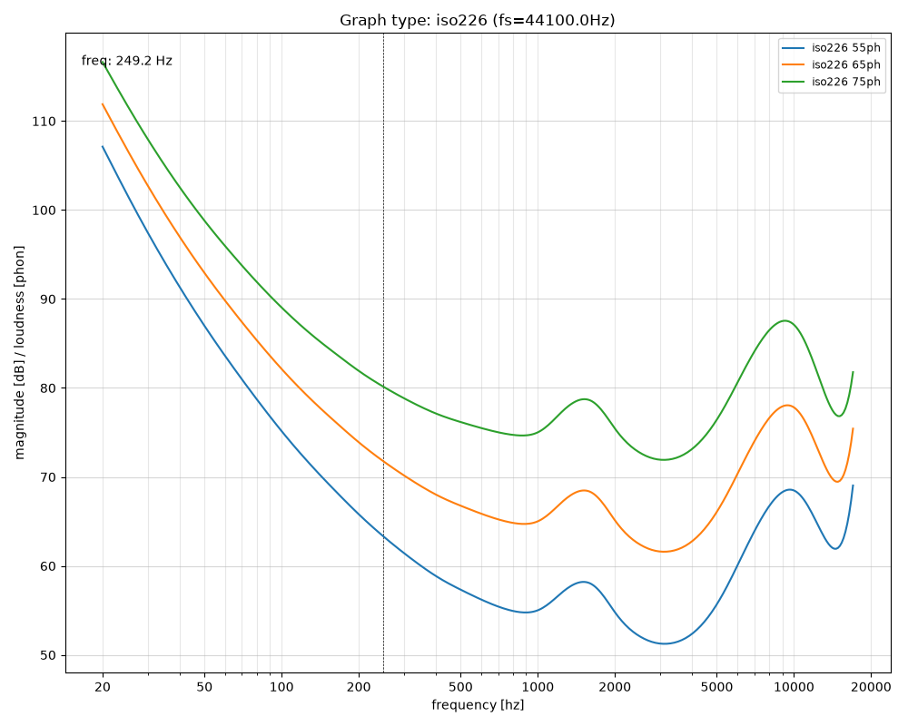
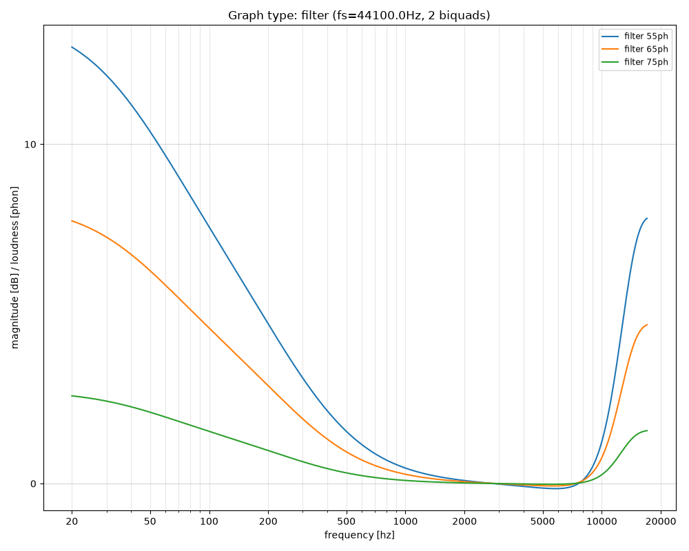
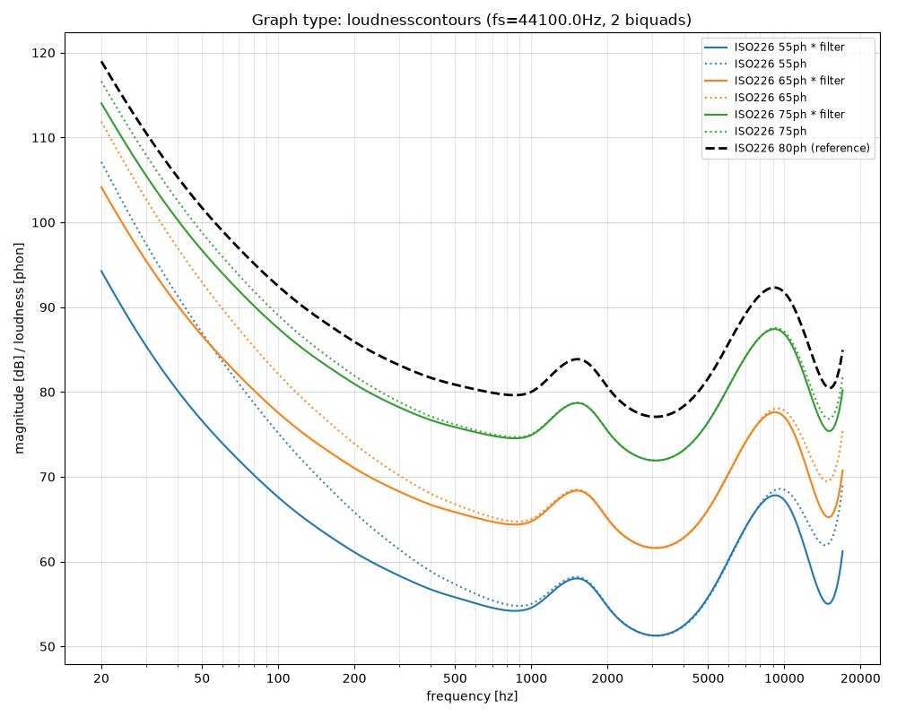

# Filter Analysis

In the loudness filter a compensates of the ISO226 2003 loudness curves

The `create2biquads.py` uses 2 biquad filters in sequence (low-shelf + high-shelf) to create a filter which makes the loudness contours for the sound mimic the shape and contour of 80 phon in the range below. Only 45 phon to 79 phon is handled.

45 phon to 79 phon roughly corresponds with 45 dB to 79 dB SPL. This is the sound level most people listen to and need loudness compensation.

## Results

The ISO226 curves used as reference looks like

The filter looks like

The compensated loudness contours looks like

