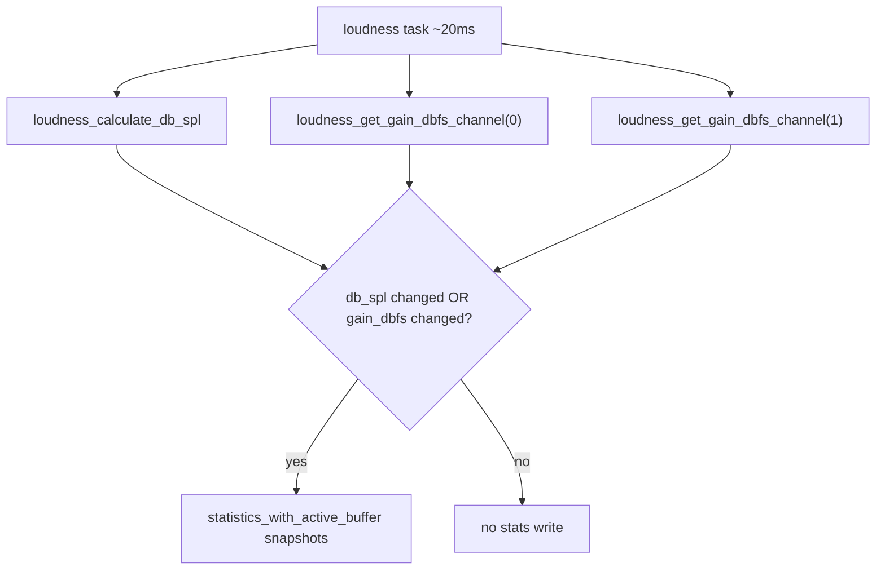

# Add gain_dbfs to USB statistics

Plan to re-expose host volume in the statistics HID packet so volume changes are visible without restoring the heavy per-audio-tick snapshot path.

## Why you see static values today

### `track_dbfs: -18` during playback is expected

The field stores the **clamped** loudness input from [`loudness_get_track_dbfs()`](../src/loudness.c), not raw RMS. It is floored at `LOUDNESS_TRACK_DBFS_MIN` (-18). Typical program material has RMS well below -18 dBFS, so the value sits at the floor most of the time. That is correct for the equalizer algorithm; it is not a bug.

### `db_spl: 80` at full volume is also expected

With host gain at 0 dBFS and track clamped to -18, the blend in [`loudness_calculate_db_spl()`](../src/loudness.c) is ~0 dBFS relative, and `LOUDNESS_REF_DB_SPL` (80) is added — yielding **80 dB SPL**. It only drops when volume is lowered (e.g. -10 dBFS volume → ~71) or when track level rises enough to push the blend up.

### Updates are sparse by design

`track_dbfs` and `db_spl` are written only inside:

```c
if (db_spl_x10 != (int32_t)last_db_spl_x10) {
    loudness_select_equalizer_step(...);
    statistics_with_active_buffer(loudness_record_stats_snapshots, ...);
}
```

The 1 Hz HID report carries the **last snapshot from the most recent integer dB SPL transition**, not live RMS. Steady volume plus quiet material makes values look frozen. **`gain_dbfs` was removed earlier** for performance, so volume is invisible in JSON unless it also moves `db_spl`.

## Proposed change: re-add `gain_dbfs`

Add host volume (dBFS) back as an S8 field, updated cheaply when volume changes.

### Wire layout (version 1, 35 bytes)

Insert `gain_dbfs` between `track_dbfs` and `db_spl`:

| Offset | Field | Type |
|--------|-------|------|
| 22–23 | `frequency_hz` | U16 LE |
| 24 | `track_dbfs` | S8 |
| 25 | `gain_dbfs` | S8 |
| 26 | `db_spl` | S8 |
| 27–30 | `event_count` | U32 LE |
| 31–34 | `last_tag` + args | U8 × 4 |

Python struct format: `"<BBBBIIHHHIHbbbIBBBB"`

### Files to change

| File | Change |
|------|--------|
| [`src/usb_statistics.h`](../src/usb_statistics.h) | Add `S8 gain_dbfs` to `usb_stats_t` and `usb_stats_packet`; `USB_STATS_PACKET_WIRE_SIZE` → 35 |
| [`src/usb_statistics.c`](../src/usb_statistics.c) | Write `gain_dbfs` at offset 25; shift `db_spl` to 26, `event_count` to 27; do **not** reset `gain_dbfs` on 1 s report (persistent snapshot) |
| [`src/loudness.c`](../src/loudness.c) | Extend snapshot context; record `gain_dbfs`; widen update trigger |
| [`usbstatistics/usbstatistics.py`](../usbstatistics/usbstatistics.py) | Parse and emit JSON key `gain_dbfs` |
| [`tests/pc/usb_statistics_tests.c`](../tests/pc/usb_statistics_tests.c) | Update wire offset asserts |
| [`docs/USB_STATISTICS.md`](USB_STATISTICS.md) | Document field and update rule |

### Update trigger (lightweight, no audio hot path)

In [`loudness_update_active_equalizer_step()`](../src/loudness.c) (~20 ms loudness task):

1. Compute `db_spl` as today.
2. Read per-channel gain via `loudness_get_gain_dbfs_channel(0)` / `loudness_get_gain_dbfs_channel(1)` (cheap: volume register math, no sqrt).
3. Snapshot when **either** condition is true:
   - `db_spl_x10 != last_db_spl_x10`
   - `gain_dbfs != last_snapshot_gain_dbfs` (new static in `loudness.c`)

On snapshot, write all three loudness fields in [`loudness_record_stats_snapshots()`](../src/loudness.c):

```c
stats->track_dbfs_x10 = (S16)loudness_get_track_dbfs();
stats->gain_dbfs_left_x10 = (S16)gain_dbfs_left_x10;
stats->gain_dbfs_right_x10 = (S16)gain_dbfs_right_x10;
stats->db_spl_left_x10 = (S16)snap->db_spl_left_x10;
stats->db_spl_right_x10 = (S16)snap->db_spl_right_x10;
```

Extend `loudness_stats_snapshot_ctx_t` to carry `gain_dbfs` (or pass both values in the context struct).

This keeps heavy work off the 100 µs audio path while making volume slider movement visible in ~20 ms (and in the next 1 s HID line).



### Expected output after reflash

| Scenario | `gain_dbfs` | `track_dbfs` | `db_spl` |
|----------|-------------|--------------|----------|
| Full volume, normal music | 0 | -18 (clamped floor) | ~80 |
| Volume -10 dBFS | -10 | -18 | ~71 |
| Loud mastered track | 0 | rises toward -6 | up to ~81 |

Moving the volume slider should change `gain_dbfs` (and usually `db_spl`) even when `track_dbfs` stays at -18.

## Implementation checklist

- [ ] Add `gain_dbfs` to `usb_stats_t`, wire builder (35 bytes), and shift offsets
- [ ] Extend loudness snapshot context and record `gain_dbfs`; trigger on `db_spl` OR gain change
- [ ] Update `usbstatistics.py`, `usb_statistics_tests.c`, and `USB_STATISTICS.md`
- [ ] Run `make test`

## Verification

1. `make test`
2. Reflash firmware; run `python usbstatistics.py --verbose`
3. Sweep OS volume while playing — confirm `gain_dbfs` tracks the slider in successive JSON lines

## Related docs

- [USB_STATISTICS.md](USB_STATISTICS.md) — current packet schema and event state machines
